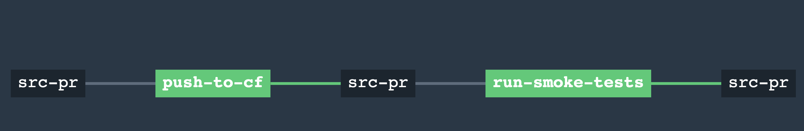
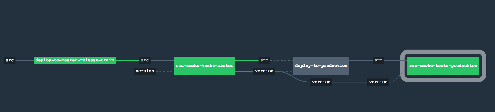

# Concourse Pipeline for deploying a Mendix application to Pivotal Cloud Foundry

The project serves an example of a continuous delivery pipeline. With this setup, a package is always ready to be deployed or redepoyed to production.
## Pipelines

* Pull Request Pipeline
* Production deployment pipeline 
## Features

* Pull Request status verification
* Automatic deploy to staging environment after merge
* Promotion from staging environment to production

## Preparing your credential file

```
cf-api: CF-API-ENDPOINT
cf-user: CF-USER
cf-password: CF-PASSWORD

github-uri: https://ACCESS-TOKEN@github.com/ORG-NAME/REPO-NAME
github-access-token: ACCESS-TOKEN
```

## Pull Request Pipeline



### Deploying with fly
```
fly -t target set-pipeline -p pull-request -c ci /pull-request-pipeline.yml -l PATH-TO-CREDENTIAL-YML
```

## Release Train Pipeline



### Deploying with fly

```
fly -t target set-pipeline -p release-train -c ci /release-train-pipeline.yml -l PATH-TO-CREDENTIAL-YML
```

