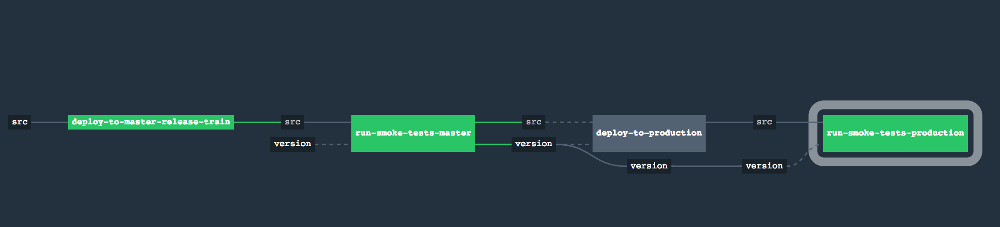

# Concourse Pipeline for deploying a Mendix application to Pivotal Cloud Foundry

## Pipelines

The project serves an example of a continuous delivery pipeline. With this setup, a package is always ready to be deployed or redepoyed to production.

## Features

* Pull Request status verification.
* Automatic deploy to staging environment after merge.
* Promotion from staging environment to production.

## Pipeline configurations

Example values are provided in the next section.

| Concourse Property | Description |
| ------------------ | ----------- |
| github-uri | Github URI. Must include an access token. |
| github-access-token | Access token for Github. |
| cf-api | API endpoints to your Cloud Foundry instance. |
| cf-user | Your Cloud Foundry username |
| cf-password | Your Cloud Foundry password |
| cf-pr-org | Name of the Cloud Foundry Org that will host the mendix application deployed for pull request testing. |
| cf-pr-space | Name of the Cloud Foundry Space that will host the mendix application deployed for pull request testing. |
| app-pr-hostname | Cloud Foundry hostname for the mendix application deployed for pull request testing. Used to compose the app URL. |
| app-pr-domain | Cloud Foundry domain for the mendix application deployed for Pull Request testing. Used to compose the app URL. |
| mendix-pr-db-name | Name of the SQL Service for the Mendix app for pull request testing. Must not be defined is a value is given to `mendix-pr-database-url`. |
| mendix-pr-database-url | Database URL for the Mendix app for pull request testing. Must not be defined is a value is given to `mendix-pr-db-name`. |
| mendix-pr-admin-password | Mendix password for the `mxadmin` account. |
| cf-staging-org | Name of the Cloud Foundry Org that will host the mendix application deployed for staging testing. |
| cf-staging-space | Name of the Cloud Foundry Space that will host the mendix application deployed for staging testing. |
| app-staging-hostname | Cloud Foundry hostname for the mendix application deployed for staging testing. Used to compose the app URL. |
| app-staging-domain | Cloud Foundry domain for the mendix application deployed for staging testing. Used to compose the app URL. |
| mendix-staging-db-name | Name of the SQL Service for the Mendix app for staging testing. Must not be defined is a value is given to `mendix-staging-database-url`. |
| mendix-staging-database-url | Database URL for the Mendix app for staging testing. Must not be defined is a value is given to `mendix-staging-db-name`. |
| mendix-staging-admin-password | Mendix password for the `mxadmin` account. |
| cf-prod-org | Name of the Cloud Foundry Org that will host the mendix application deployed for production.  |
| cf-prod-space | Name of the Cloud Foundry Space that will host the mendix application deployed for production. |
| app-prod-hostname | Cloud Foundry hostname for the mendix application deployed for production. Used to compose the app URL. |
| app-prod-domain | Cloud Foundry domain for the mendix application deployed for production. Used to compose the app URL. |
| mendix-prod-db-name | Name of the SQL Service for the Mendix app for production. Must not be defined is a value is given to `mendix-prod-database-url`. |
| mendix-prod-database-url | Database URL for the Mendix app for production. Must not be defined is a value is given to `mendix-prod-db-name`. |
| mendix-prod-admin-password | Mendix password for the `mxadmin` account. |

## Preparing your credential file

Please refere to the previous section to understand each configuration properties.

```
# Github Configuration
github-uri: # ex: https://63b55803523sdf2wxv32sq180e3f33962ad601b2@github.com/daniellavoie/pcf-mendix-demo
github-access-token: # ex: 63b55803523sdf2wxv32sq180e3f33962ad601b2

# Pivotal Cloud Foundry Configuration
cf-api: # ex: api.run.pivotal.io
cf-user: # ex: dlavoie@pivotal.io
cf-password: # ex: ************

# Pull Request Space Configuration
cf-pr-org: # ex: my-org
cf-pr-space: # ex: my-pull-request-space
app-pr-hostname: # demo-app-pr
app-pr-domain: # ex: cfapps.io
mendix-pr-db-name: # ex: mendix-staging-db
mendix-pr-database-url: postgresql://postgresqladmin@posgresql-server:2018.QAZxsw2@posgresql-server.postgres.database.azure.com:5432/my-pr-db?sslmode=require
mendix-pr-admin-password: Pivotal2018@PCF

# Staging Space Configuration
cf-staging-org: # ex: my-org
cf-staging-space: # ex: my-staging-space
app-staging-hostname: # ex: demo-app-staging
app-staging-domain: # ex: cfapps.io
mendix-staging-db-name: # ex: mendix-staging-db
mendix-staging-database-url: # ex: postgresql://admin-user@posgresql-server:admin-password@server-hostname:5432/my-staging-db?sslmode=require
mendix-staging-admin-password: # ex: Pivotal2018@PCF

# Production Space Configuration
cf-prod-org: # ex: my-org
cf-prod-space: # ex : my-prod-space
app-prod-hostname: # ex: demo-app-prod
app-prod-domain: # ex: cfapps.io
mendix-prod-db-name: # ex: mendix-prod-db
mendix-prod-database-url: # ex: postgresql://admin-user@posgresql-server:admin-password@server-hostname:5432/my-prod-db?sslmode=require
mendix-prod-admin-password: # ex: Pivotal2018@PCF
```

## Pull Request Pipeline


### Deploying with fly

```
fly -t target set-pipeline -p pull-request -c ci/pull-request-pipeline.yml -l PATH-TO-CREDENTIAL-YML
```

## Deploy to production Pipeline



### Deploying with fly

```
fly -t target set-pipeline -p master -c ci/master-pipeline.yml -l PATH-TO-CREDENTIAL-YML
```

